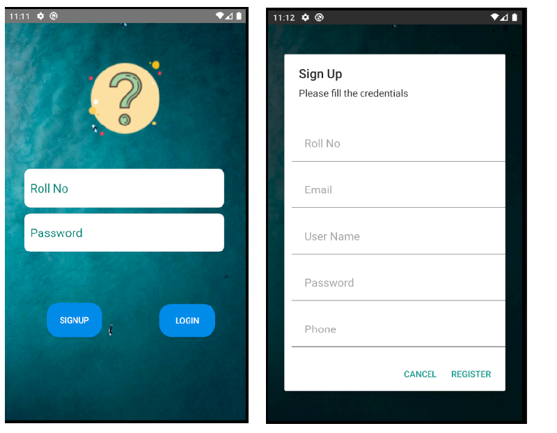
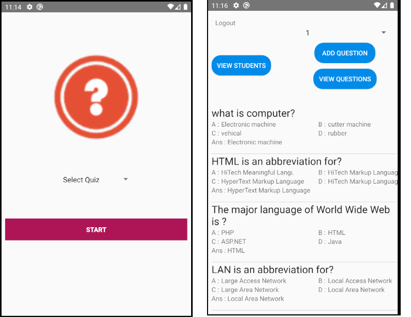

# Quiz-App-Android-Firebase
This App is deveoped to make manual quiz to make it online and access to multiple users to check his/her results.

## How to use
- Clone this project
- Make you Firebase account currently connect with my own
- In Android Studio Tools -> Firebase -> Connect Firebase
- Run this App on your device and register a user account
- The credentials for Admin panel is:
    Rollno: "admin"
    Password: "admin"
- Add your questions with correct answers and enjoy!!!

## App Design

## Contributions 
Contributions, issues and feature requests are welcome.
Feel free to check [issues](https://github.com/UmairAnjum86/Quiz-App/issues "issues") page if you want to contribute.

## About Me
My name is Umair Anjum, I am Software Engineer at TECHZO Solution Pakistan. I have expertise in Native Android | React - Native| Android | Java | Kotlin | Javascript | MVVM | MVP | RxJava | Dagger | Material Design | Live Data | Data Binding.

- Github : [Umair Anjum ](https://github.com/UmairAnjum86 "Umair Anjum")
- Facebook : [Umair Anjum](facebook.com/umair.anjum.357/ "Umair Anjum")
